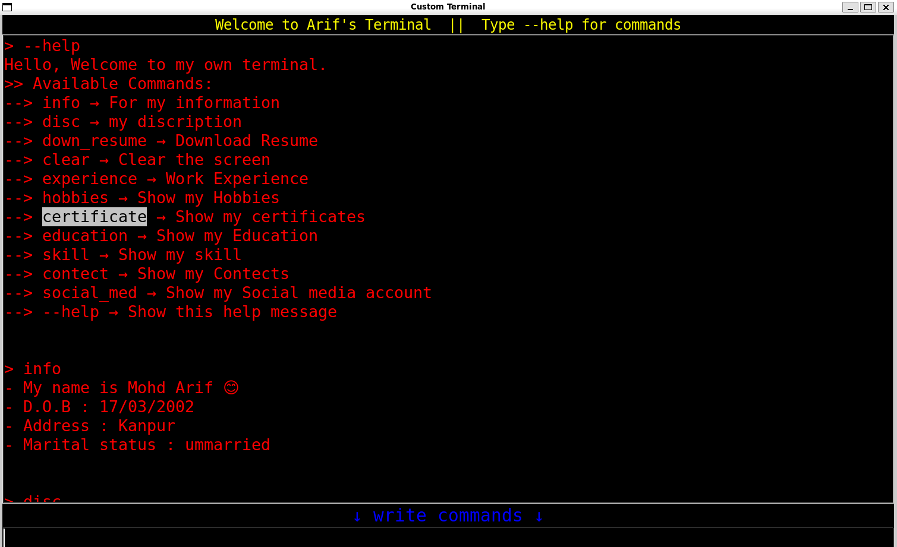

## 💻 Arif's Personal Terminal (Tkinter GUI)

This is a personal terminal-style GUI app built using Python's Tkinter library. It accepts custom commands to display personal details, skills, social links, and even opens URLs like your GitHub or LinkedIn profile.

---

### 🖼️ Preview



---

### 🚀 Features

* Terminal-style input/output
* Command-driven personal portfolio
* Opens GitHub, LinkedIn directly in browser
* Tkinter-based clean GUI
* Easy to extend and modify

---

### 🧠 Available Commands

| Command       | Description                         |
| ------------- | ----------------------------------- |
| `--help`      | List all available commands         |
| `info`        | Show basic personal info            |
| `disc`        | Show personal description           |
| `down_resume` | Placeholder for downloading resume  |
| `experience`  | Show experience list                |
| `lr`          | Opens Linear Regression GitHub link |
| `hobbies`     | Display hobbies                     |
| `certificate` | Show certifications                 |
| `education`   | Show academic details               |
| `skill`       | List technical and soft skills      |
| `contect`     | Display contact information         |
| `social_med`  | List social media shortcut commands |
| `github`      | Open GitHub profile                 |
| `linkdin`     | Open LinkedIn profile               |
| `lang`        | List known languages                |
| `clear`       | Clear terminal output               |

---

### 🧑‍💻 Tech Stack

* **Language:** Python
* **GUI:** Tkinter
* **Other:** `webbrowser` module for opening links

---

### 📦 How to Run

1. Clone the repository:

   ```bash
   git clone https://github.com/mohdarif1234/arif-terminal.git
   cd arif-terminal
   ```

2. Run the script:

   ```bash
   python terminal.py
   ```

> ⚠️ Make sure you have Python installed (preferably Python 3.8+).

---

### 📝 Author

**Mohd Arif**
📍 Kanpur, India
📧 [mohammadarif5761@gmail.com](mailto:mohammadarif5761@gmail.com)
🔗 [LinkedIn](https://www.linkedin.com/in/arifmohd5761/)
🐙 [GitHub](https://github.com/mohdarif1234)

